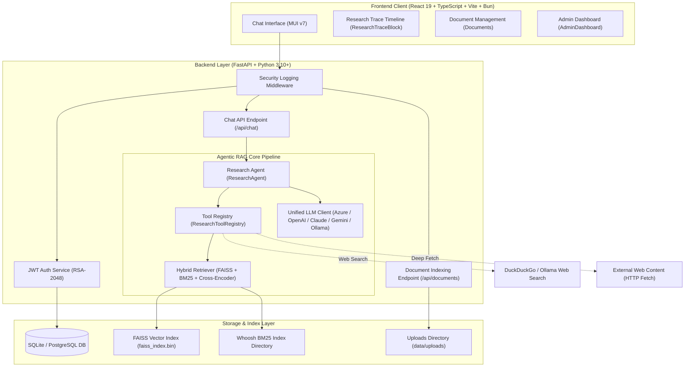

# AskMiao (AI ChatBot)

An enterprise-grade intelligent knowledge-base conversational system powered by Contextual Hybrid RAG (Retrieval-Augmented Generation) and Agentic Autonomous Research architectures.

[繁體中文](README.md) | [English](README_en.md)

[](https://fastapi.tiangolo.com/)
[](https://react.dev/)
[](https://www.python.org/)
[](https://vitejs.dev/)
[](https://bun.sh/)
[](https://www.sqlite.org/)
[](LICENSE)

[Quick Start](#quick-start) | [Core Features](#core-features) | [System Architecture](#system-architecture) | [Directory Structure](#directory-structure) | [Environment Variables](#environment-variables) | [Documentation](#documentation) | [Contributing](#contributing) | [License](#license)

---

## Quick Start

### Requirements

| Component | Minimum Version | Recommended Tool & Purpose |
|---|---|---|
| Python | 3.10 or higher | Backend FastAPI server, RAG vector indexing, and Agentic research engine |
| Bun | 1.0 or higher | Preferred package manager and build tool for frontend |
| SQLite | 3.x (Built-in) | Default relational database with zero-dependency local launch |

### 1. Clone Repository

```bash
git clone https://github.com/Scorpio-meow/AskMiao.git
cd AskMiao
```

### 2. Backend Setup & Launch

```bash
cd backend

# Create and activate Python virtual environment
python -m venv .venv

# Windows PowerShell:
.\.venv\Scripts\Activate.ps1
# Linux/macOS:
source .venv/bin/activate

# Install backend dependencies
pip install -r requirements.txt

# Copy environment template (Defaults to SQLite zero-dependency configuration)
cp .env.example .env

# Initialize database schema and admin account
python init_db.py

# Start FastAPI development server (Port 8001)
python -m uvicorn main:app --reload --host 0.0.0.0 --port 8001
```

### 3. Frontend Setup & Launch (Bun Preferred)

```bash
cd ../frontend

# Install frontend dependencies using Bun
bun install

# Start Vite development server (Port 5173 / 3001)
bun run dev
```

Once launched, navigate to `http://localhost:5173` in your browser to start using AskMiao.

---

## Core Features

1. **Agentic RAG & Multi-Turn Autonomous Research**:
   - Built-in ReAct research agent (`ResearchAgent`) supporting Native Tool Calling.
   - Comprehensive toolset including internal knowledge search (`search_knowledge_base`), real-time web search (`web_search` with Ollama & DuckDuckGo dual-engine fallback), and deep web fetch (`web_fetch`).
   - Collapsible research trace timeline (`ResearchTraceBlock`) and clickable reference badges (`SourceBadges`) in frontend UI.

2. **Reasoning Effort Multi-Tier Selection**:
   - Navigation header selector with 5 reasoning depth levels: `None (none)`, `Low (low)`, `Medium (medium)`, `High (high)`, and `Extreme (xhigh)`.
   - Full support for Azure OpenAI v1 and OpenAI reasoning models (GPT-5 series, o-series).
   - Automatic compatibility enforcement with tool calls per Microsoft Foundry specifications.

3. **Modular Contextual Hybrid RAG Pipeline**:
   - Integrates dense vector search (FAISS) and sparse Chinese keyword search (Whoosh BM25).
   - Re-ranked dynamically by Cross-Encoder (`ms-marco-MiniLM-L-6-v2` / `bge-reranker-base`) for optimal precision.
   - Automated dynamic Alpha tuning and quantitative RAG evaluation metrics (Hit Rate, MRR).

4. **Multi-Provider LLM Integration**:
   - Unified abstraction layer supporting dynamic switching between Azure OpenAI v1, OpenAI Official, Anthropic Claude, Google Gemini, and local Ollama models with automatic multi-model list normalization.

5. **Enterprise Security & Two-Layer Data Redaction**:
   - Dual-token security with RSA-2048 signed Access Tokens and HttpOnly Secure Cookies.
   - Recursive object-level masking and regex redaction (`security_logging.py`) preventing credential leaks in logs.

---

## System Architecture



---

## Directory Structure

```text
AskMiao/
├── backend/                        # Backend FastAPI project
│   ├── app/
│   │   ├── api/                    # RESTful API endpoints (auth, chat, documents, admin)
│   │   ├── core/                   # Core configurations, auth, security logging & LLM client
│   │   │   ├── config.py           # Global settings & environment configuration
│   │   │   ├── jwt_auth.py         # RSA-2048 JWT signing and token verification
│   │   │   ├── llm_client.py       # Multi-provider LLM calling client
│   │   │   └── security_logging.py # Sensitive data redaction logging system
│   │   ├── models/                 # SQLAlchemy ORM and Pydantic schemas
│   │   ├── rag/                    # Modular RAG and Agentic research engine
│   │   │   ├── agent.py            # ReAct Research Agent
│   │   │   ├── tools.py            # Local RAG, Web Search, and Web Fetch tools
│   │   │   ├── pipeline.py         # RAG pipeline execution & prompt assembly
│   │   │   ├── contextual_rag.py   # HybridContextualRAG facade module
│   │   │   ├── evaluator.py        # Retrieval evaluation & auto-tune Alpha
│   │   │   ├── indices/            # FAISS and BM25 store handlers
│   │   │   └── retrievers/         # Hybrid search & Cross-Encoder re-rankers
│   │   ├── services/               # Business logic services (ChatService, DocumentService)
│   │   └── tasks/                  # Background tasks (periodic reindexing, uploads watcher)
│   ├── tests/                      # Automated test suite (pytest)
│   ├── main.py                     # FastAPI application entry point
│   ├── init_db.py                  # Database initialization and admin seeder
│   └── requirements.txt            # Python dependencies
├── frontend/                       # Frontend React 19 + Vite project
│   ├── src/
│   │   ├── pages/                  # Application page components
│   │   │   ├── Chat/               # Chat modules (MessageItem, TraceBlock, SourceBadges, Header)
│   │   │   ├── Documents/          # Knowledge document management
│   │   │   ├── Admin/              # System admin dashboard
│   │   │   ├── Login/ & Register/  # Authentication views
│   │   │   └── Profile/            # User profile view
│   │   ├── hooks/                  # Custom React hooks (useChat, useAuth)
│   │   ├── services/               # Axios API client & token interceptors
│   │   └── components/             # Reusable UI components and Layout
│   ├── package.json                # Frontend package configuration (Bun managed)
│   └── vite.config.js              # Vite build setup
├── docs/                           # Documentation specifications
│   ├── api.md                      # API Reference (Traditional Chinese)
│   ├── api_en.md                   # API Reference (English)
│   ├── architecture.md             # System Architecture & Design (Traditional Chinese)
│   ├── architecture_en.md          # System Architecture & Design (English)
│   └── adr/                        # Architecture Decision Records
├── llms.txt                        # AI-friendly system index (Traditional Chinese)
├── llms_en.txt                     # AI-friendly system index (English)
├── CHANGELOG.md                    # Changelog (Traditional Chinese)
├── CHANGELOG_en.md                 # Changelog (English)
└── LICENSE                         # MIT License
```

---

## Environment Variables

### Backend Configuration (`backend/.env`)

| Variable | Description | Example / Default | Required |
|---|---|---|---|
| `ENABLE_WEB_SEARCH` | Enable Agent web search tools | `true` | No |
| `AGENT_MAX_TURNS` | Max autonomous tool-calling turns for Agent | `5` | No |
| `AZURE_OPENAI_API_KEY` | Azure OpenAI API Key | `your_azure_api_key` | No |
| `AZURE_OPENAI_ENDPOINT` | Azure OpenAI v1 service endpoint URL | `https://your-resource.services.ai.azure.com` | No |
| `AZURE_OPENAI_DEPLOYMENT`| Azure OpenAI deployment names (Comma-separated) | `gpt-5.6-luna,gpt-5.6-terra` | No |
| `OPENAI_API_KEY` | OpenAI Official API Key (Optional) | `sk-...` | No |
| `ANTHROPIC_API_KEY` | Anthropic Claude API Key (Optional) | `sk-ant-...` | No |
| `GEMINI_API_KEY` | Google Gemini API Key (Optional) | `AIza...` | No |
| `LLM_API_BASE` | Local Ollama endpoint URL | `http://localhost:5000` | No |
| `MODEL_NAME` | Local default model name | `gemma4:26b` | No |
| `JWT_SECRET_KEY` | JWT signing secret key | `cb_jwt_sec_...` | Yes |
| `ADMIN_API_KEY` | System Administrator API Key | `cb_admin_key_...` | Yes |
| `DATABASE_URL` | Database connection string | `sqlite:///./chatbot.db` | No |
| `EMBEDDING_MODEL` | Embedding model identifier | `paraphrase-multilingual-MiniLM-L12-v2` | No |
| `RERANKER_MODEL` | Re-ranking model identifier | `cross-encoder/ms-marco-MiniLM-L-6-v2` | No |

### Frontend Configuration (`frontend/.env`)

| Variable | Description | Default | Required |
|---|---|---|---|
| `VITE_API_BASE` | Backend API base path or proxy | `/api` | No |
| `VITE_API_URL` | Backend absolute URL for CORS direct connection | `http://localhost:8001` | No |

---

## Documentation

- [API Reference](./docs/api_en.md) — RESTful endpoints, request/response JSON schemas, and WebSocket specs
- [Architecture & Design](./docs/architecture_en.md) — System modules, Agentic RAG pipeline, and security design
- [Architecture Decision Records (ADR)](./docs/adr/README_en.md) — Architectural decisions and trade-offs
- [AI System Guide](./llms_en.txt) — Machine-readable guide for AI Agents and LLMs
- [Changelog](./CHANGELOG_en.md) — Version release history

---

## Contributing

Contributions are welcome! Please follow these steps:

1. Fork the repository and create your feature branch (`git checkout -b feature/amazing-feature`).
2. Ensure code passes type checks and tests:
   - Backend tests: `pytest tests/`
   - Frontend validation: `bun x tsc --noEmit`, `bun run build`, `bun run lint`
3. Commit your changes (`git commit -m 'feat: Add amazing feature'`).
4. Push to your branch (`git push origin feature/amazing-feature`).
5. Open a Pull Request with a clear description of your changes.

---

## License

This project is licensed under the MIT License. See [LICENSE](LICENSE) for details.