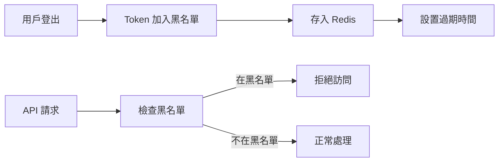
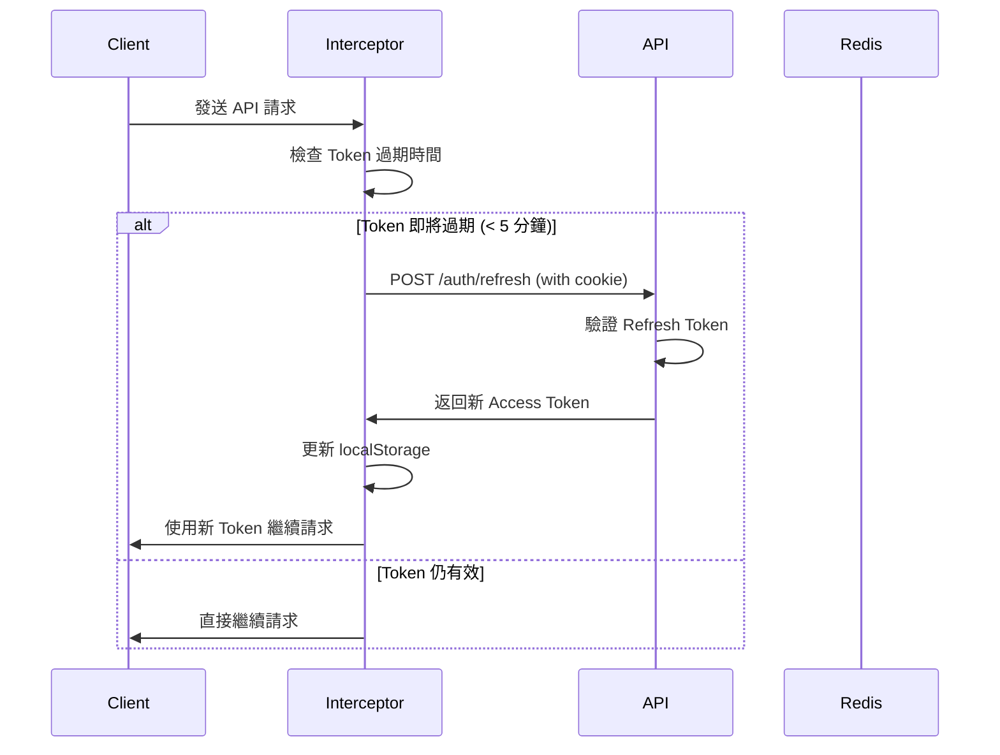

# 安全增強功能說明文檔

本文檔說明 ChatBot 應用程式的安全增強功能，包括 RSA 非對稱加密、Token 黑名單、HttpOnly Cookie、靜默刷新和離線處理。

---

## 📋 目錄

1. [功能概覽](#功能概覽)
2. [RSA 非對稱加密](#rsa-非對稱加密)
3. [Token 黑名單系統](#token-黑名單系統)
4. [HttpOnly Cookie 存儲](#httponly-cookie-存儲)
5. [靜默刷新機制](#靜默刷新機制)
6. [離線處理功能](#離線處理功能)
7. [環境配置](#環境配置)
8. [使用指南](#使用指南)
9. [安全最佳實踐](#安全最佳實踐)

---

## 🎯 功能概覽

### 已實現的安全增強

| 功能 | 說明 | 狀態 |
|------|------|------|
| **RSA 非對稱加密** | 使用 RSA-2048 進行 JWT 簽名 | ✅ 完成 |
| **Token 黑名單** | Redis 快取實現 Token 撤銷機制 | ✅ 完成 |
| **HttpOnly Cookie** | Refresh Token 存儲在安全 Cookie | ✅ 完成 |
| **靜默刷新** | Token 即將過期時自動刷新 | ✅ 完成 |
| **離線處理** | 網絡狀態檢測和離線緩存 | ✅ 完成 |

---

## 🔐 RSA 非對稱加密

### 概述

使用 RSA 非對稱加密算法替代 HMAC-SHA256 對稱加密，增強微服務架構中的安全性。

### 技術細節

- **算法**: RSA-2048
- **簽名**: 使用私鑰簽名 JWT
- **驗證**: 使用公鑰驗證 JWT
- **金鑰存儲**: `backend/keys/` 目錄

### 金鑰管理

```python
# 後端自動生成金鑰對（首次啟動時）
from app.core.rsa_keys import rsa_manager

# 金鑰位置
# - 私鑰: backend/keys/jwt_private.pem
# - 公鑰: backend/keys/jwt_public.pem
```

### 優勢

✅ **微服務友好**: 公鑰可分發給多個服務驗證 Token  
✅ **更高安全性**: 私鑰僅保存在認證服務器  
✅ **不可偽造**: 攻擊者無法偽造有效 Token

### 環境變量

```bash
# .env
JWT_ALGORITHM=RS256  # 使用 RSA 算法
```

---

## 🚫 Token 黑名單系統

### 概述

使用 Redis 實現 Token 撤銷機制，確保用戶登出後 Token 立即失效。

### 技術細節

- **存儲**: Redis（內存數據庫）
- **過期策略**: 自動過期（基於 Token 的剩餘有效期）
- **鍵格式**: `blacklist:token:{token}`

### 工作流程



### 使用示例

```python
# 撤銷 Token
from app.core.jwt_auth import revoke_token

revoke_token(access_token)  # 自動計算過期時間
revoke_token(access_token, expires_in=3600)  # 手動指定過期時間
```

### 降級策略

⚠️ **Redis 不可用時**：系統仍可正常運行，但 Token 黑名單功能將不可用。

### 環境變量

```bash
# .env
REDIS_HOST=localhost
REDIS_PORT=6379
REDIS_DB=0
REDIS_PASSWORD=  # 可選
```

---

## 🍪 HttpOnly Cookie 存儲

### 概述

將 Refresh Token 存儲在 HttpOnly Cookie 中，防止 XSS 攻擊竊取 Token。

### Cookie 配置

```python
response.set_cookie(
    key="refresh_token",
    value=refresh_token,
    httponly=True,      # 防止 JavaScript 訪問
    secure=True,        # 僅 HTTPS 傳輸
    samesite="lax",     # CSRF 保護
    max_age=7*24*60*60, # 7 天
    path="/api/auth"    # 僅認證端點可用
)
```

### 安全優勢

| 特性 | 說明 |
|------|------|
| **HttpOnly** | JavaScript 無法訪問，防止 XSS 攻擊 |
| **Secure** | 僅在 HTTPS 下傳輸，防止中間人攻擊 |
| **SameSite** | 防止 CSRF 跨站請求偽造 |
| **Path 限制** | 僅在特定路徑下發送 |

### API 變更

#### 登入 (POST /api/auth/login)

**響應**:
```json
{
  "user": { ... },
  "tokens": {
    "access_token": "eyJ...",
    "token_type": "bearer",
    "refresh_token": ""  // 不在響應體中返回
  }
}
```

**Cookie**:
```
Set-Cookie: refresh_token=eyJ...; HttpOnly; Secure; SameSite=Lax; Path=/api/auth; Max-Age=604800
```

#### 刷新 (POST /api/auth/refresh)

**請求**: 無需 body（從 Cookie 讀取）  
**響應**: 新的 access_token + 更新的 refresh_token Cookie

---

## 🔄 靜默刷新機制

### 概述

在 Access Token 即將過期前自動刷新，無需用戶重新登入，提升用戶體驗。

### 刷新策略

```javascript
// 前端自動檢測 Token 過期
if (shouldRefreshToken(access_token, 300)) {  // 提前 5 分鐘刷新
  await refreshToken();
}
```

### 工作流程



### 關鍵參數

- **刷新閾值**: 300 秒（5 分鐘）
- **Token 有效期**: 30 分鐘（可配置）
- **併發控制**: 防止多個請求同時刷新

### 用戶體驗

✅ **無感知**: 用戶無需重新登入  
✅ **自動化**: 完全自動處理  
✅ **高效**: 僅在必要時刷新

---

## 📡 離線處理功能

### 概述

檢測網絡狀態並提供離線緩存，確保應用在網絡不穩定時仍可使用。

### 功能特性

1. **網絡狀態監聽**
   - 實時檢測在線/離線狀態
   - 自動顯示狀態提示

2. **離線緩存**
   - 使用 IndexedDB 存儲待處理請求
   - 網絡恢復後自動同步

3. **用戶提示**
   - 離線時顯示警告
   - 上線時顯示成功提示

### 使用示例

```javascript
// 監聽網絡狀態
import networkMonitor from './utils/networkMonitor';

networkMonitor.addListener((status) => {
  if (status === 'online') {
    console.log('網絡已連接');
    // 同步離線數據
  } else {
    console.log('網絡已斷開');
    // 啟用離線模式
  }
});

// 檢查當前狀態
const isOnline = networkMonitor.checkOnline();
```

```javascript
// 離線緩存
import offlineCache from './utils/offlineCache';

// 添加離線請求
await offlineCache.addRequest({
  url: '/api/chat/send',
  method: 'POST',
  data: { content: '離線消息' },
  type: 'chat'
});

// 獲取所有待處理請求
const pending = await offlineCache.getAllRequests();

// 刪除已處理請求
await offlineCache.removeRequest(requestId);
```

### 集成到應用

```jsx
// App.js
import NetworkStatus from './components/NetworkStatus';

function App() {
  return (
    <>
      <NetworkStatus />
      {/* 其他組件 */}
    </>
  );
}
```

---

## ⚙️ 環境配置

### 後端配置 (.env)

```bash
# JWT 配置
JWT_SECRET_KEY=your-secret-key-change-this  # RSA 模式下可選
JWT_ALGORITHM=RS256  # 使用 RSA 算法
ACCESS_TOKEN_EXPIRE_MINUTES=30
REFRESH_TOKEN_EXPIRE_DAYS=7

# Redis 配置（Token 黑名單）
REDIS_HOST=localhost
REDIS_PORT=6379
REDIS_DB=0
REDIS_PASSWORD=

# CORS 配置
CORS_ORIGINS=http://localhost:3000
```

### 前端配置 (.env)

```bash
# API Base URL
REACT_APP_API_BASE=http://localhost:8000/api

# 或使用 proxy（開發環境）
# package.json: "proxy": "http://localhost:8000"
```

### 依賴安裝

#### 後端

```bash
# 安裝新增的依賴
pip install cryptography redis aioredis

# 或使用 requirements.txt
pip install -r requirements.txt
```

#### 前端

```bash
# 安裝 JWT 解碼庫
npm install jwt-decode

# 或 yarn
yarn add jwt-decode
```

---

## 📖 使用指南

### 啟動步驟

1. **啟動 Redis** (可選，如不啟動則黑名單功能不可用)

```bash
# Windows (使用 WSL 或 Docker)
docker run -d -p 6379:6379 redis:alpine

# Linux/Mac
redis-server
```

2. **啟動後端**

```bash
cd backend
python -m uvicorn main:app --reload --host 0.0.0.0 --port 8000
```

系統會自動：
- 生成 RSA 金鑰對（如不存在）
- 連接 Redis（如可用）

3. **啟動前端**

```bash
cd frontend
npm start
```

### 測試

```bash
# 運行安全測試腳本
cd backend
python scripts/test_security_enhancements.py
```

測試內容：
- ✅ RSA 金鑰生成
- ✅ 用戶註冊（HttpOnly Cookie）
- ✅ Token 驗證
- ✅ Token 刷新
- ✅ Token 撤銷（黑名單）
- ✅ 重新登入

---

## 🛡️ 安全最佳實踐

### 生產環境建議

1. **HTTPS 強制**
   ```nginx
   # Nginx 配置
   server {
       listen 443 ssl;
       ssl_certificate /path/to/cert.pem;
       ssl_certificate_key /path/to/key.pem;
   }
   ```

2. **RSA 金鑰保護**
   ```bash
   # 設置私鑰權限（僅擁有者可讀）
   chmod 600 backend/keys/jwt_private.pem
   ```

3. **Redis 認證**
   ```bash
   # redis.conf
   requirepass your-strong-password
   ```

4. **環境變量安全**
   ```bash
   # 不要將 .env 提交到版本控制
   echo ".env" >> .gitignore
   ```

### Token 配置建議

| Token 類型 | 建議有效期 | 說明 |
|-----------|----------|------|
| Access Token | 15-30 分鐘 | 短期有效，頻繁刷新 |
| Refresh Token | 7-30 天 | 長期有效，安全存儲 |

### 監控和日誌

```python
# 啟用安全日誌
from app.core.security_logging import log_security_event

log_security_event("TOKEN_REFRESHED", user_id=user.id)
log_security_event("TOKEN_REVOKED", user_id=user.id)
```

---

## 📊 性能影響

| 功能 | 性能影響 | 說明 |
|------|---------|------|
| RSA 簽名 | 輕微 (+2-5ms) | 比 HMAC 稍慢，但安全性更高 |
| Token 黑名單 | 極小 (+1-2ms) | Redis 內存查詢，非常快 |
| HttpOnly Cookie | 無 | 僅改變存儲方式 |
| 靜默刷新 | 極小 | 異步處理，不阻塞用戶操作 |
| 離線緩存 | 極小 | IndexedDB 異步操作 |

---

## 🔧 故障排除

### 常見問題

#### 1. Redis 連接失敗

**症狀**: `Redis 連接失敗` 警告  
**解決**: 
- 確認 Redis 已啟動
- 檢查 `REDIS_HOST` 和 `REDIS_PORT` 配置
- 系統可在無 Redis 情況下運行（黑名單功能不可用）

#### 2. RSA 金鑰未生成

**症狀**: `RSA 金鑰載入失敗` 錯誤  
**解決**:
```bash
# 手動生成金鑰
cd backend
python -c "from app.core.rsa_keys import rsa_manager; rsa_manager.generate_keys()"
```

#### 3. Cookie 未設置

**症狀**: 前端無法獲取 refresh_token  
**解決**:
- 確認 `withCredentials: true` 已設置
- 檢查 CORS 配置允許 credentials
- 驗證 Cookie 的 `path` 和 `domain` 設置

#### 4. 靜默刷新失敗

**症狀**: Token 過期後需要重新登入  
**解決**:
- 檢查 `jwt-decode` 是否已安裝
- 確認 `shouldRefreshToken` 邏輯正確
- 查看瀏覽器控制台錯誤

---

## 📞 支持

如有問題或建議，請聯繫開發團隊或提交 Issue。

---

**版本**: 1.0.0  
**更新日期**: 2025年10月3日
