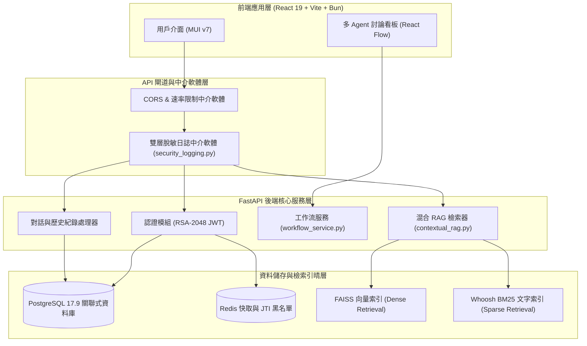
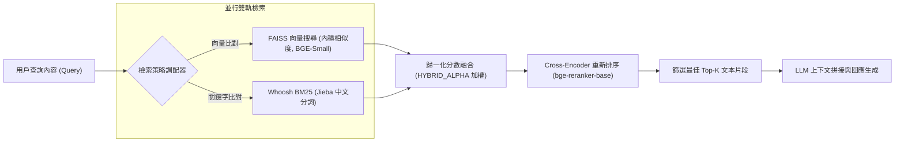
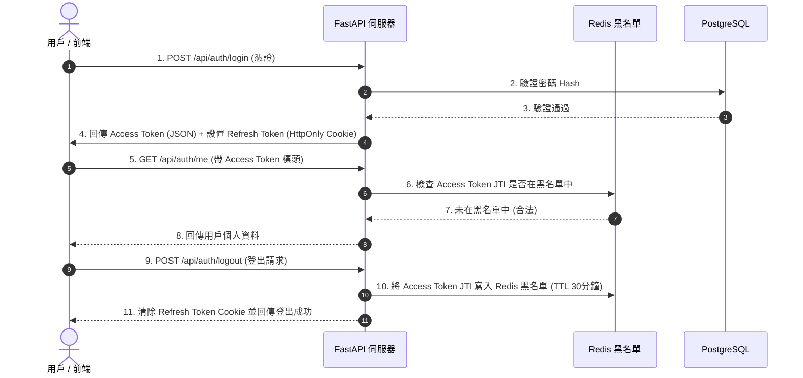
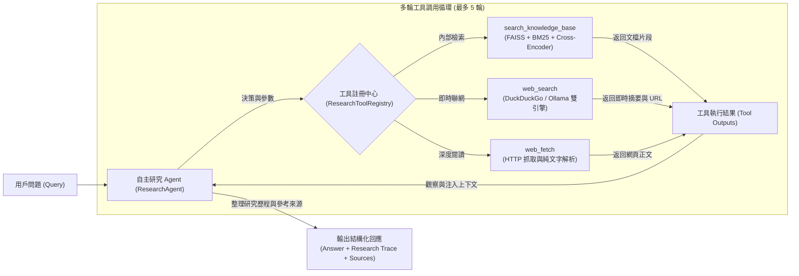

# AskMiao 系統架構與設計文件

[繁體中文](architecture.md) | [English](architecture_en.md)

> 本文件說明 AskMiao 系統整體架構、核心模組關係、增強型混合 RAG 檢索流程、RSA-2048 雙 Token 安全認證機制與多 Agent 協作工作流設計。

---

## 1. 系統整體分層架構圖

AskMiao 採用前後端分離與模組化架構。前端由 React 19 與 Vite 7 驅動，後端由 FastAPI 提供非同步 RESTful API 及 WebSocket 串流服務，資料持久層使用 PostgreSQL 17.9，並利用 Redis 提供快取與令牌黑名單防護。

---

## 2. 增強型混合 RAG 檢索與重排序管道

系統採用密集的向量搜尋（Dense Retrieval）與稀疏的關鍵字搜尋（Sparse Retrieval）並行檢索機制，檢索結果經由歸一化分數融合後，送入 Cross-Encoder 模型進行深度重排序（Reranking）。

### 檢索管道核心處理解析

1. **文字切塊 (Chunking)**：上傳文件經 `RecursiveCharacterTextSplitter` 處理，預設區塊大小為 300 字元，相鄰區塊重疊 100 字元。
2. **向量嵌入 (Embedding)**：預設採用 `BAAI/bge-small-zh-v1.5` 模型的 384 維度向量空間。
3. **關鍵字檢索 (BM25)**：結合 `Whoosh` 搜尋引擎與 `Jieba` 自訂領域詞庫進行中文分詞。
4. **重排序 (Reranking)**：Cross-Encoder (`bge-reranker-base`) 對候選片段計算深度交叉注意力度量，濾除無關片段並提升準確率。

---

## 3. RSA-2048 雙 Token 認證與黑名單生命週期

系統採用 Access Token 與 Refresh Token 雙令牌機制。Access Token 具備 30 分鐘短壽命，Refresh Token 存放於安全的 HttpOnly Cookie 中（有效期 7 天），並利用 Redis 進行主動撤銷控制。

---

## 4. Agentic RAG 自主研究與多輪工具調用管線

系統採用 ReAct 自主研究代理人架構（`ResearchAgent`），透過 Native Tool Calling 實現智慧多輪工具協同與上下文自主搜集。

### 自主研究核心機制

1. **動態決策思考**：模型根據用戶問題語境，自主判斷是否需查詢內部知識庫、外部即時聯網或深入閱讀外部 URL。
2. **研究歷程追蹤 (Research Trace)**：每一輪工具調用之步驟名稱、輸入參數、輸出摘要與執行耗時均被結構化記錄，供前端進行即時折疊視覺化呈現。
3. **來源標籤與跳轉 (Sources Detail)**：整合內部文檔片段與外部網頁連結，生成精確之來源標籤，支援使用者點擊直接驗證資訊出處。

---

## 5. 安全性與敏感資料雙層脫敏防護

為遵循安全防護與通過安全稽核（修復 CodeQL `py/clear-text-logging-sensitive-data` 告警），系統於 `backend/app/core/security_logging.py` 實施了兩道強制遮罩防線：

1. **物件層級遞迴脫敏 (`sanitize_sensitive_data`)**：
   - 遍歷所有字典與列表物件。
   - 匹配敏感 Key（包含 `password`, `token`, `secret`, `authorization`, `cookie` 等不分大小寫欄位）。
   - 將對應 Value 統一替換為 `[REDACTED]`。
2. **字串層級二次正則遮罩**：
   - 在 JSON 序列化或日誌輸出前，調用正則表達式防線進行二次掃描。
   - 確保任何格式的敏感金鑰皆不會遺留於日誌檔案中。

---

## 6. 架構決策紀錄 (ADR)

專案重大架構決策均獨立記載於 ADR 文件中：

- [ADR 索引與說明](./adr/README.md)
- [ADR-0001: 增強型混合 RAG 檢索架構與雙 Token 安全防護決策](./adr/0001-hybrid-rag-and-security.md)