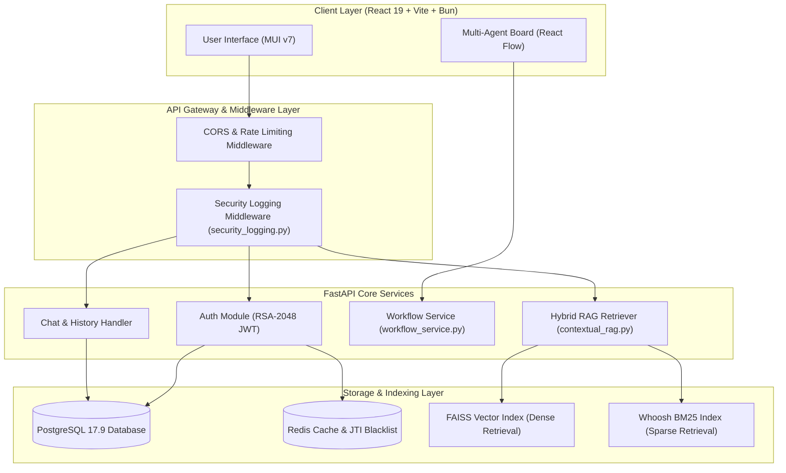
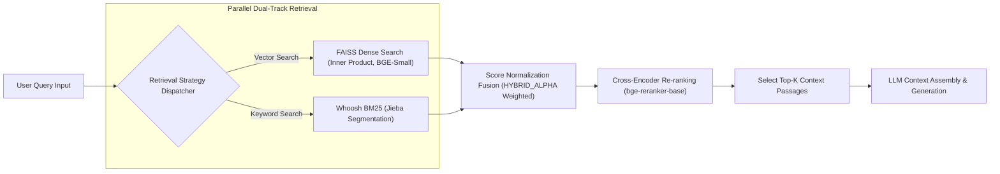
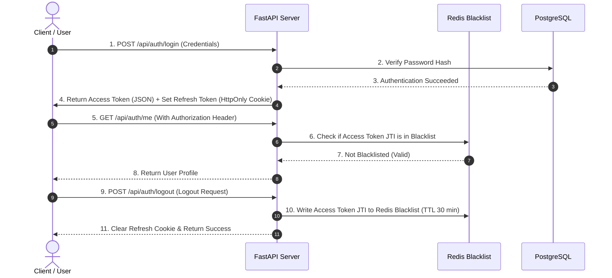
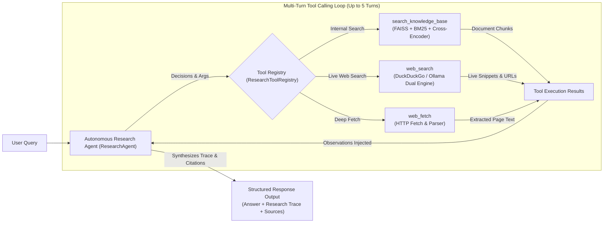

# AskMiao System Architecture & Design

[繁體中文](architecture.md) | [English](architecture_en.md)

> This document details the overall system architecture, core module relationships, Contextual Hybrid RAG retrieval pipeline, RSA-2048 dual-token authentication, and multi-Agent collaboration design for AskMiao.

---

## 1. High-Level Layered Architecture

AskMiao adopts a decoupled frontend-backend architecture. The frontend is built with React 19 and Vite 7, while the backend is powered by FastAPI delivering asynchronous RESTful APIs and WebSocket services. PostgreSQL 17.9 handles relational persistence, and Redis manages caching and token blacklists.

---

## 2. Contextual Hybrid RAG Retrieval & Re-ranking Pipeline

The system employs parallel dual-track retrieval combining dense vector search (FAISS) and sparse keyword search (Whoosh BM25). Candidates are merged via score normalization and re-ranked using a Cross-Encoder model.

### Retrieval Pipeline Details

1. **Text Chunking**: Uploaded documents are processed via `RecursiveCharacterTextSplitter` (default 300 characters chunk size, 100 characters overlap).
2. **Vector Embedding**: Uses 384-dimensional vector space powered by `BAAI/bge-small-zh-v1.5`.
3. **Keyword Retrieval (BM25)**: Powered by `Whoosh` and `Jieba` custom domain dictionary.
4. **Re-ranking**: Cross-Encoder (`bge-reranker-base`) computes cross-attention relevance scores, filtering irrelevant chunks and maximizing accuracy.

---

## 3. RSA-2048 Dual-Token Auth & Blacklist Lifecycle

Short-lived Access Tokens (30 min) signed with RSA-2048 private key are paired with Refresh Tokens (7 days) stored in HttpOnly / Secure / SameSite Cookies, backed by Redis instant revocation.

---

## 4. Agentic RAG Autonomous Research & Tool Pipeline

The system employs a ReAct autonomous agent architecture (`ResearchAgent`), using Native Tool Calling for multi-turn dynamic research and contextual synthesis.

### Key Autonomous Capabilities

1. **Context-Aware Decision Making**: The agent autonomously determines whether internal documentation, live web search, or full web page scraping is required to answer the query accurately.
2. **Research Trace Auditing**: Every tool step, arguments, execution duration, and output preview are captured in structured format for real-time visualization in the frontend timeline component.
3. **Interactive Source Attribution**: Integrates internal knowledge chunks with external web links, allowing users to verify facts and open primary sources with one click.

---

## 5. Security & Two-Layer Sensitive Data Redaction

To enforce security standards and resolve CodeQL warnings (`py/clear-text-logging-sensitive-data`), two mandatory redaction defenses are implemented in `backend/app/core/security_logging.py`:

1. **Object-Level Recursive Masking (`sanitize_sensitive_data`)**:
   - Recursively traverses dictionaries and lists.
   - Matches sensitive key names (case-insensitive `password`, `token`, `secret`, `authorization`, `cookie`, etc.).
   - Replaces matching values with `[REDACTED]`.
2. **Regex String-Level Defense**:
   - Secondary regex filter executed prior to JSON serialization and log emission.
   - Guarantees zero leak of sensitive credentials in system logs.

---

## 6. Architecture Decision Records (ADR)

Major architectural decisions are recorded in standalone ADR documents:

- [ADR Index](./adr/README_en.md)
- [ADR-0001: Contextual Hybrid RAG & Dual-Token Security Architecture](./adr/0001-hybrid-rag-and-security_en.md)